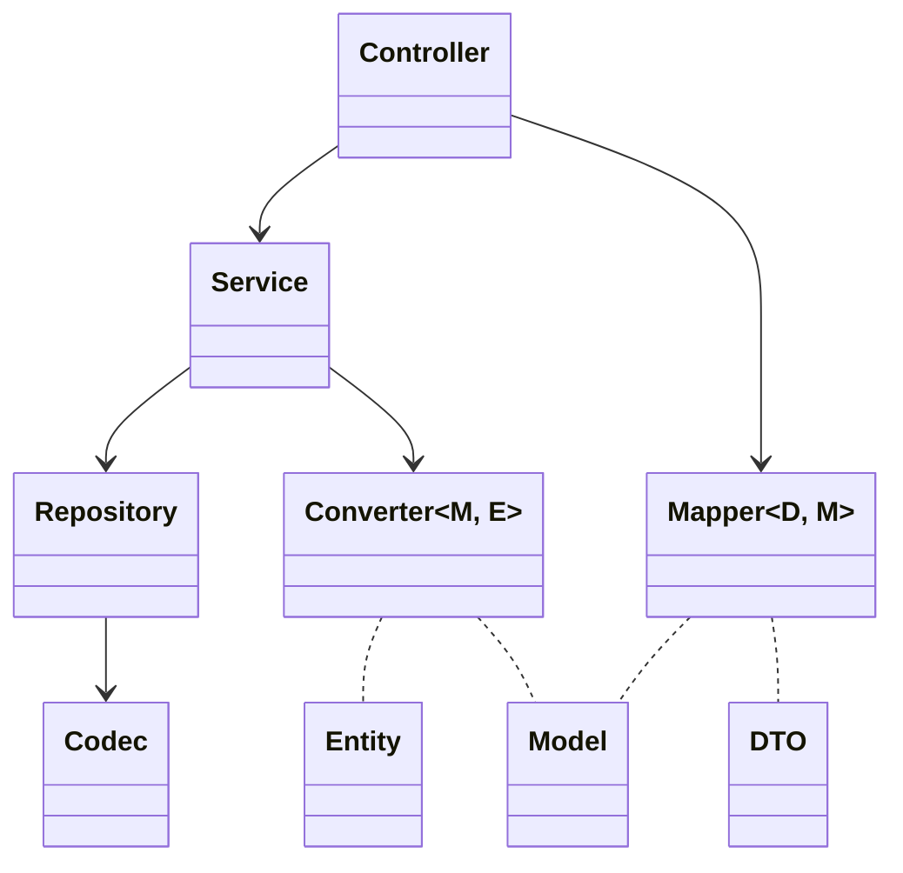
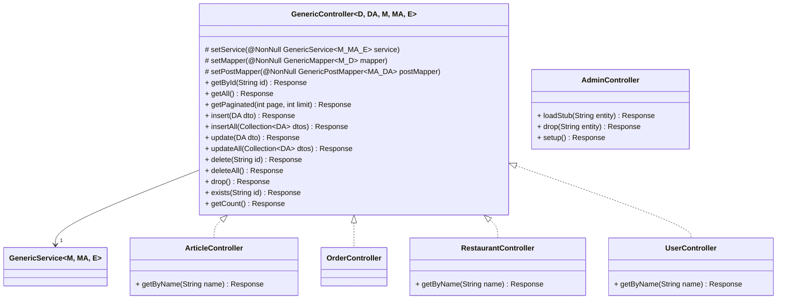
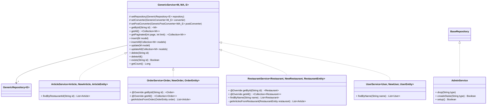
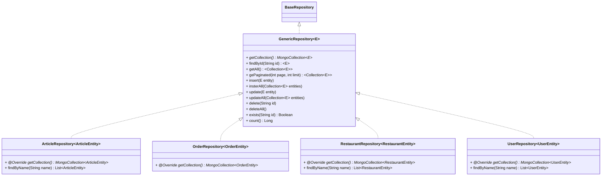

# Mong-eat

A Quarkus API for a MongoDB database.

## 📝 Purpose

- Create a [Quakus](https://quarkus.io) API using a [MongoDB](https://www.mongodb.com/) database.
- Implement the CRUD operations to manage a *food delivery service*.

## 🛠 Languages & tools

## 🖊️ Versions 

- [Java SDK](https://www.java.com/): 17
- [Quarkus](https://quarkus.io): 3

## MongoDB

### Getting Started

In order to get a quick setup of a MongoDB database, you can use [Docker Desktop](https://www.docker.com/products/docker-desktop/).

1. Add a container with the `mongo:latest` image
2. Set ports to `27017:27017`
3. Launch the container

> The API is setup with the default MongoDB port `27017`. Feel free to change it at your convenience.

### Collections

> Find the database collections description [here](./Documentation/Database/Collections.md).

### CDM

> Find a simple CDM [here](./Documentation/Database/CDM.md). 
> It doesn't fill well with mongo but that can help to understand objects interractions.

## Quarkus API

### Getting Started

> Make sure to get a running MongoDB container before starting the API.

To setup the API quickly we will use [IDEA Intellji](https://www.jetbrains.com/idea/).

1. Open `./Sources/` as a project
2. Add a configuration to run the `./Sources/src/main/java/com/mongeat/launch/Main.java` main. *(pom will automatically download dependencies)*
3. Launch the configuration with Java SDK 17 or newer
4. With a browser or Postman, go to `http://localhost:8080/admin/setup`
5. Feel free to explore the API with [swagger](http://localhost:8080/q/swagger-ui/).

You can also use the `./Documentation/API/Mong-eat.postman_collection.json` file to import the API in Postman.

### Architecture

> Theses diagrams are not fully accurate and only gave the global idea of the conception.

 Structure 

This API is implement following the Controller -> Service -> Repository architecture.
* Controllers:
    - Handle the HTTP requests
    - Call the services
    - Return the responses
* Services:
    - Handle the business logic
    - Call the repositories
* Repositories:
    - Handle the database access
    - Call the codecs

To interact through the layers and convert **DTOs** to **Models** and **Models** to **Entities**, we use mappers and converters.
It allows us to keep the layers independant and to have a better control over the data.
It allows improve the code readability and maintainability.

 Controllers 

The controllers are the entry point of the API.
- They handle the HTTP requests
- They call the services
- They return the responses

 Services 

The services are the core of the API.
- They handle the business logic
- They call the repositories

 Repositories 

The repositories are the link between the API and the database.
- They handle the database access
- They call the codecs

## ✍️ Credits

* Co-author [Mathis Ribémont](https://github.com/TEDDAC)
* Co-author [Valentin Clergue](https://github.com/HandyS11)